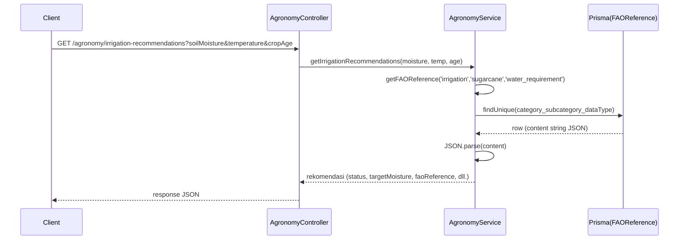

# Dokumentasi Modul Agronomy (FAO)

## Deskripsi Umum

Modul Agronomy menyediakan layer akses ke data referensi FAO yang disimpan di database dan mengkonversinya menjadi guideline praktis: kondisi optimal, rekomendasi irigasi, dan penilaian kesehatan tanah.

## Struktur File

- Controller: [agronomy.controller.ts](file:///d:/PROJECT/AWAL/Agricane/backend/src/agronomy/agronomy.controller.ts)
- Service: [agronomy.service.ts](file:///d:/PROJECT/AWAL/Agricane/backend/src/agronomy/agronomy.service.ts)
- Module: [agronomy.module.ts](file:///d:/PROJECT/AWAL/Agricane/backend/src/agronomy/agronomy.module.ts)

## Ringkasan Logika

- `AgronomyService`:
  - Menyimpan base URL FAO dari konfigurasi (`fao.baseUrl`) untuk kemungkinan integrasi ke depan; saat ini sumber data FAO utama adalah tabel `FAOReference`.
  - In‑memory cache `Map` keyed `(category:subcategory:dataType)` dengan TTL 1 hari.
  - `getFAOReference`:
    - Cek cache → jika ada dan belum kedaluwarsa, kembalikan.
    - Query `FAOReference` dengan unique key gabungan.
    - Parse kolom `content` (string JSON) menjadi objek JS.
  - `getAllFAOReferences`: mengembalikan semua record dengan `content` sudah di‑parse.
  - `saveFAOReference`: membuat/men‑update record FAO di DB.
  - `getSugarcaneGuidelines`: mengambil beberapa kategori (irrigation, soil, climate, pest_management) dan menyatukan dalam satu objek guideline.
  - `getOptimalConditions(crop)`: kumpulan `climate`, `soil`, dan `irrigation` untuk crop tertentu (default sugarcane).
  - `getIrrigationRecommendations`: membangun rekomendasi teks berdasarkan moisture dan parameter dari referensi FAO.
  - `getSoilHealthAssessment`: membandingkan pH aktual terhadap range optimal dari FAO dan mengeluarkan assessment teks.

## Fungsi Utama

- AgronomyService.getFAOReference(category, subcategory, dataType)
- AgronomyService.getAllFAOReferences()
- AgronomyService.saveFAOReference(category, subcategory, dataType, content, metadata?)
- AgronomyService.getSugarcaneGuidelines()
- AgronomyService.getOptimalConditions(crop?: string)
- AgronomyService.getIrrigationRecommendations(soilMoisture, temperature, cropAge)
- AgronomyService.getSoilHealthAssessment(soilPH, organicMatter?)

## Alur Kerja

Contoh alur `GET /agronomy/irrigation-recommendations`:



## Konfigurasi & Variabel Penting

- [configuration.ts](file:///d:/PROJECT/AWAL/Agricane/backend/src/config/configuration.ts#L22-L25)
  - `fao.baseUrl`, `fao.domainCode` (disiapkan untuk integrasi FAOSTAT API).
- Seeder FAO di [seed.ts](file:///d:/PROJECT/AWAL/Agricane/backend/prisma/seed.ts#L124-L194) mengisi data awal:
  - `irrigation.water_requirement`,
  - `soil.sugarcane_soil`,
  - `climate.optimal_range`,
  - `pest_management.integrated_approach`.

## Contoh Kode

```ts
const irrigation = await this.getFAOReference('irrigation', 'sugarcane', 'water_requirement');
if (!irrigation) {
  return { recommendation: 'FAO reference data not available', status: 'unknown' };
}
```

## Catatan Khusus

- Data FAO disimpan sebagai string JSON di DB; bila ingin dikonsumsi modul lain, pastikan selalu di‑parse terlebih dahulu.
- Threshold dan teks rekomendasi pada `getIrrigationRecommendations` dan `getSoilHealthAssessment` adalah heuristik yang bisa disesuaikan dengan agronomist.  
