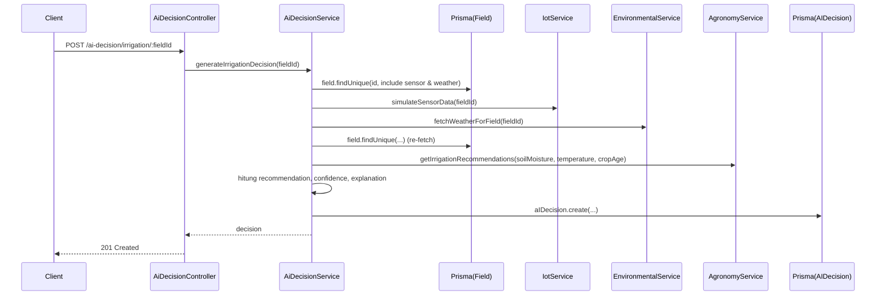

# Dokumentasi Modul AI Decision Support

## Deskripsi Umum

Modul AI Decision menggabungkan berbagai sumber data (Field, Sensor/IoT, Cuaca, NDVI, FAO) untuk menghasilkan tiga jenis keputusan utama:

- Rekomendasi irigasi,
- Kesiapan panen,
- Risk assessment (resiko cuaca, pH, stress vegetasi).

Semua keputusan disimpan ke tabel `ai_decisions` sebagai jejak audit lengkap.

## Struktur File

- Controller: [ai.decision.controller.ts](file:///d:/PROJECT/AWAL/Agricane/backend/src/ai-decision/ai.decision.controller.ts)
- Service: [ai.decision.service.ts](file:///d:/PROJECT/AWAL/Agricane/backend/src/ai-decision/ai.decision.service.ts)
- Module: [ai.decision.module.ts](file:///d:/PROJECT/AWAL/Agricane/backend/src/ai-decision/ai.decision.module.ts)

## Ringkasan Logika

- `AiDecisionController`:
  - `POST /ai-decision/irrigation/:fieldId`:
    - Role: ADMIN, AGRONOMIST, MANAGER.
    - Menghasilkan rekomendasi irigasi baru, sekaligus menyimpan record keputusan.
  - `POST /ai-decision/harvest/:fieldId`:
    - Menghasilkan keputusan readiness panen.
  - `POST /ai-decision/risk-assessment/:fieldId`:
    - Menghasilkan penilaian resiko (HIGH/MEDIUM/LOW).
  - `GET /ai-decision/history/:fieldId?limit`:
    - Mengambil histori keputusan untuk satu field.
  - `GET /ai-decision/by-type/:fieldId?type`:
    - Filter histori berdasarkan `decisionType`.
- `AiDecisionService`:
  - Menggunakan `PrismaService`, `AgronomyService`, `IotService`, `EnvironmentalService`.
  - Setiap generator keputusan:
    - Mengumpulkan data terbaru (sensor, cuaca, NDVI),
    - Menghitung parameter turunan (umur tanaman, rata‑rata, total curah hujan, dll.),
    - Menerapkan aturan heuristik (if/else) untuk menentukan kategori dan confidence,
    - Menyusun teks `explanation` yang cukup panjang dan kontekstual,
    - Menyimpan keputusan ke `AIDecision` dengan berbagai field JSON (`contextData`, `weatherFactors`, dll.).

## Fungsi Utama

- AiDecisionService.generateIrrigationDecision(fieldId: string)
- AiDecisionService.generateHarvestReadinessDecision(fieldId: string)
- AiDecisionService.generateRiskAssessment(fieldId: string)
- AiDecisionService.getDecisionHistory(fieldId: string, limit?: number)
- AiDecisionService.getDecisionsByType(fieldId: string, type: string)

## Alur Kerja — Rekomendasi Irigasi

### Detail Logika (Irigasi)

- Ambil field + sensor + cuaca terbaru.
- Hitung `cropAge` berdasarkan `plantingDate`.
- Berdasarkan `latestSensor.soilMoisture`:
  - `< 35` → `IMMEDIATE_IRRIGATION_REQUIRED`, confidence ~0.95.
  - `35–50` → `SCHEDULE_IRRIGATION_24H`, confidence ~0.88.
  - `> 75` → `REDUCE_IRRIGATION`, confidence ~0.82.
  - lainnya → `MAINTAIN_CURRENT_SCHEDULE`, confidence ~0.90.
- Tambahkan konteks:
  - Faktor cuaca: temperature, humidity, rainfall;
  - Faktor tanah: moisture, pH, temperature;
  - Referensi FAO: cropCoefficient, waterRequirement, efficiency (jika tersedia).

## Alur Kerja — Kesiapan Panen

- Ambil field + `ndviData` + `sensorReadings`.
- Hitung umur tanaman (`cropAge`) dan rata‑rata soil moisture.
- Bandingkan `cropAge` dengan jendela optimal (sekitar 365 hari):
  - `< 300` → `TOO_EARLY`,
  - `300–350` → `MONITOR_CLOSELY`,
  - `350–420` → `READY_FOR_HARVEST`,
  - `> 420` → `OVERDUE_HARVEST`.
- Jika NDVI ada, masukkan nilai & status ke `ndviFactors`.
- Simpan record ke `AIDecision` dengan `decisionType = 'HARVEST_READINESS'`.

## Alur Kerja — Risk Assessment

- Ambil field + `weatherData` + `sensorReadings` + `ndviData` terbaru.
- Hitung rata‑rata temperature (`avgTemp`) dan total curah hujan (`totalRainfall`).
- Aturan heuristik:
  - Jika `avgTemp > 35` → tambahkan `HEAT_STRESS`, overallRisk minimal HIGH.
  - Jika `totalRainfall > 100` → tambahkan `EXCESS_RAINFALL`, overallRisk minimal MEDIUM.
  - Jika pH terakhir di luar [5.5, 8.0] → `SOIL_PH_IMBALANCE`.
  - Jika `healthStatus` NDVI terakhir `SEVERE_STRESS` → `VEGETATION_STRESS`, overallRisk HIGH.
- Gabungkan semua `risks` & `warnings` ke dalam `explanation` dan `contextData`.
- Simpan ke `AIDecision` dengan `recommendation = overallRisk`.

## Konfigurasi & Variabel Penting

- Tidak ada env khusus di modul ini; modul menggunakan konfigurasi modul lain (Environmental, Agronomy, IoT).
- Threshold seperti 35%, 50%, 75%, umur 365 hari, curah hujan 100mm, pH 5.5–8.0 adalah nilai hard‑coded yang bisa dianggap sebagai parameter model AI heuristik.

## Catatan Khusus (Bagian yang Jelas AI‑Generated / Heuristik)

- Struktur penjelasan (`explanation`) panjang dengan kalimat natural, digabung dari berbagai variabel → sangat tipikal hasil generatif.
- Threshold dan kategori keputusan (IMMEDIATE_IRRIGATION_REQUIRED, READY_FOR_HARVEST, HEAT_STRESS, dsb.) dirangkai berdasarkan asumsi umum, bukan referensi penelitian eksplisit.
- Sebelum digunakan di produksi, sebaiknya:
  - Dikonfirmasi dan dikalibrasi oleh agronomist lapangan,
  - Dipindahkan ke konfigurasi (misalnya tabel `ai_rules`),
  - Diberi logging dan mungkin dipantau kinerjanya (berapa sering sesuai realitas).  
