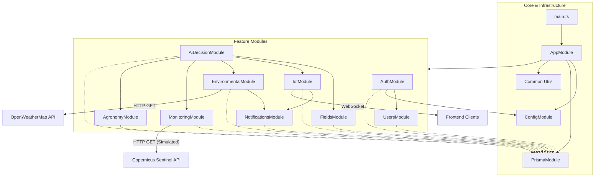

# Arsitektur Backend AgriCane

## Gambaran Umum

Backend dibangun dengan NestJS (modular, opinionated framework di atas Node.js) dan Prisma sebagai ORM ke PostgreSQL. Arsitektur dasarnya mengikuti prinsip **Clean Architecture** yang disesuaikan dengan modul NestJS:

- **Lapisan HTTP/WebSocket (Controller/Gateway)**: Menerima request eksternal (REST API) atau event real-time (Socket.IO).
- **Lapisan Layanan (Service)**: Berisi logika bisnis utama, orkestrasi antar modul, dan aturan keputusan.
- **Lapisan Data (Repository/Prisma)**: Akses langsung ke database PostgreSQL menggunakan Prisma Client.
- **Infrastruktur & Utilitas**: Modul konfigurasi, autentikasi, dan fungsi global (guards, interceptors).

## Struktur Modul Utama

| Modul        | Folder                        | Tanggung Jawab Utama                                                                 |
|--------------|-------------------------------|--------------------------------------------------------------------------------------|
| Core         | `src/app.module.ts`, `main.ts`| Bootstrap aplikasi, registrasi modul, konfigurasi global, Swagger, guard, filter     |
| Config       | `src/config`                  | Memetakan environment variable ke konfigurasi terstruktur                            |
| Prisma       | `src/prisma`, `prisma/`       | Koneksi database, definisi schema, seeding                                          |
| Auth         | `src/auth`                    | Login, register, refresh token, guard JWT, RBAC, decorator                           |
| Users        | `src/users`                   | CRUD user, manajemen role dan status aktif                                          |
| Fields       | `src/fields`                  | CRUD lahan, perhitungan umur tanaman, query berdasarkan growth status                |
| Environmental| `src/environmental`           | Integrasi OpenWeather, cache response, cron update cuaca                             |
| Agronomy     | `src/agronomy`                | Akses data referensi FAO dan transformasi guideline agronomi                         |
| IoT          | `src/iot`                     | REST + WebSocket untuk sensor tanah, analisis anomali, statistik                     |
| Monitoring   | `src/monitoring`              | NDVI, kesehatan tanaman, dan log penerbangan drone                                   |
| AI Decision  | `src/ai-decision`             | Engine rekomendasi irigasi, readiness panen, dan risk assessment                     |
| Notifications| `src/notifications`           | Notifikasi sistem & user, filter unread, helper alert khusus                         |
| Common       | `src/common`                  | Enum global (Role, Status), filter global HTTP                                       |

## Diagram Hubungan Antar Modul

Diagram berikut menggambarkan ketergantungan (dependencies) dan aliran data antar modul dalam backend.

## Pola Komunikasi Antar Modul

Backend ini menggunakan beberapa pola komunikasi untuk interaksi antar komponen:

### 1. Synchronous Service Injection (Direct Calls)
Pola paling umum dimana satu `Service` di-inject ke `Service` lain.
- **Contoh**: `AiDecisionService` mengimpor `FieldsService`, `IotService`, `EnvironmentalService`, dll.
- **Tujuan**: Mengumpulkan data dari berbagai sumber untuk membuat keputusan terpusat.
- **Implementasi**: Menggunakan Dependency Injection (DI) NestJS via constructor.

### 2. Event-Based Communication (WebSocket)
Digunakan untuk komunikasi real-time ke client (frontend), bukan antar modul backend internal (meskipun bisa diperluas).
- **Contoh**: `IotGateway` menerima data sensor → memanggil `IotService` untuk simpan DB → mem-broadcast event `sensor_update` ke room spesifik.
- **Flow**: `Client` (Sensor) → `Gateway` → `Service` → `DB` → `Gateway` → `Client` (Dashboard).

### 3. Scheduled Tasks (Cron Jobs)
Komunikasi asynchronous berbasis waktu.
- **Contoh**: `EnvironmentalCron` berjalan setiap 6 jam.
- **Flow**: Cron Trigger → `EnvironmentalService.fetchWeatherForAllFields()` → External API → Update DB.

### 4. Database Shared Access
Semua modul berbagi satu instance `PrismaService` untuk akses database. Tidak ada pemisahan database per microservice (Monolithic Modular).
- **Pola**: Modul A menulis ke tabel X, Modul B membaca dari tabel X.
- **Contoh**: `IotService` menulis ke `SensorReading`. `AiDecisionService` membaca `SensorReading` via `PrismaService` (atau via `IotService` wrapper).

### 5. DTO (Data Transfer Objects)
Standarisasi format data antar layer.
- Input divalidasi menggunakan `class-validator` di level Controller.
- Data yang bersih diteruskan ke Service.

## Alur Detail Fitur Utama

### 1. Autentikasi & Autorisasi
- **Alur**: User Login → `AuthService` (validasi DB) → Generate JWT (via `JwtService`) → Return Token.
- **Proteksi**: Setiap request berikutnya dicek oleh `JwtAuthGuard` (validasi signature) dan `RolesGuard` (validasi hak akses).

### 2. AI Decision Engine (Pusat Logika)
Modul ini adalah konsumen data terbesar.
- **Input**:
  - Data Lahan (dari `FieldsService`)
  - Data Cuaca (dari `EnvironmentalService`)
  - Data Sensor (dari `IotService`)
  - Data NDVI (dari `MonitoringService`)
  - Referensi FAO (dari `AgronomyService`)
- **Proses**: Menggabungkan semua data → Menjalankan rule-based logic (if-else heuristic) → Menghasilkan `Recommendation`.
- **Output**: Disimpan di `AiDecision` table dan dikembalikan ke API.

### 3. Deteksi Anomali & Notifikasi
- **Trigger**: Data sensor baru masuk via IoT atau update cuaca.
- **Proses**: `IotService` mengecek threshold (batas aman). Jika melanggar → Panggil `NotificationsService`.
- **Output**: `NotificationsService` membuat record notifikasi baru di DB (yang nantinya dipolling oleh client).

## Catatan Implementasi

- **Dependency Cycles**: Hati-hati dengan circular dependency (Modul A butuh B, B butuh A). Gunakan `forwardRef()` jika terpaksa, tapi sebaiknya refactor ke modul ketiga (Common).
- **Transaction Management**: Saat ini operasi lintas modul belum dibungkus transaksi global. Jika `AiDecision` gagal simpan tapi `SensorReading` sudah tersimpan, bisa terjadi inkonsistensi data (walaupun minor). Untuk penulisan ulang, pertimbangkan `prisma.$transaction`.
