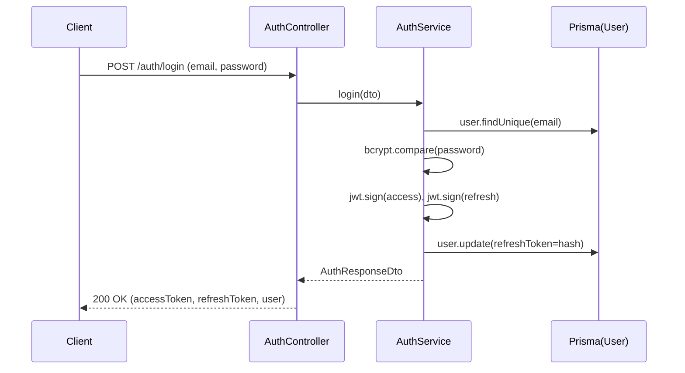

# Dokumentasi Modul Auth

## Deskripsi Umum

Modul autentikasi menangani pendaftaran, login, refresh token, dan logout. Proteksi endpoint menggunakan JWT guard global dan RBAC berbasis role (decorator `@Roles`).

## Struktur File

- Controller: [auth.controller.ts](file:///d:/PROJECT/AWAL/Agricane/backend/src/auth/auth.controller.ts)
- Service: [auth.service.ts](file:///d:/PROJECT/AWAL/Agricane/backend/src/auth/auth.service.ts)
- Module: [auth.module.ts](file:///d:/PROJECT/AWAL/Agricane/backend/src/auth/auth.module.ts)
- Strategies: 
  - [jwt.strategy.ts](file:///d:/PROJECT/AWAL/Agricane/backend/src/auth/strategies/jwt.strategy.ts)
  - [jwt.refresh.strategy.ts](file:///d:/PROJECT/AWAL/Agricane/backend/src/auth/strategies/jwt.refresh.strategy.ts)
- Guards:
  - [jwt.auth.guard.ts](file:///d:/PROJECT/AWAL/Agricane/backend/src/auth/guards/jwt.auth.guard.ts)
  - [jwt.refresh.guard.ts](file:///d:/PROJECT/AWAL/Agricane/backend/src/auth/guards/jwt.refresh.guard.ts)
  - [roles.guard.ts](file:///d:/PROJECT/AWAL/Agricane/backend/src/auth/guards/roles.guard.ts)
- Decorators:
  - [current-user.decorators.ts](file:///d:/PROJECT/AWAL/Agricane/backend/src/auth/decorators/current-user.decorators.ts)
  - [roles.decorator.ts](file:///d:/PROJECT/AWAL/Agricane/backend/src/auth/decorators/roles.decorator.ts)
- DTO:
  - [auth.dtos.ts](file:///d:/PROJECT/AWAL/Agricane/backend/src/auth/dto/auth.dtos.ts)

## Ringkasan Logika

- `AuthService`:
  - Register: cek duplikasi email, hash password, buat user, generate token, simpan refresh token ter‑hash.
  - Login: validasi password & status aktif, generate token, update refresh token.
  - Refresh: validasi refresh token vs hash di DB, generate ulang token, rotasi refresh token.
  - Logout: null‑kan refresh token user.
- Strategies:
  - `JwtStrategy`: validasi access token, memastikan user aktif.
  - `JwtRefreshStrategy`: validasi refresh token dari `Authorization: Bearer`, ambil user beserta `refreshToken`.
- Guards:
  - `JwtAuthGuard`: lewatkan endpoint bertanda `@Public()`, selain itu wajib JWT.
  - `RolesGuard`: endpoint bertanda `@Roles(Role...)` hanya bisa diakses jika `request.user.role` cocok.

## Fungsi Utama

- AuthService.register(registerDto): AuthResponseDto
- AuthService.login(loginDto): AuthResponseDto
- AuthService.refreshTokens(userId, refreshToken): AuthResponseDto
- AuthService.logout(userId): void
- JwtStrategy.validate(payload): user light‑profile
- JwtRefreshStrategy.validate(req, payload): user + refreshToken

## Alur Kerja

- Controller memanggil service; service menggunakan `PrismaService.user` untuk akses DB, `JwtService` untuk tanda tangan token, `ConfigService` untuk secret/expiry.
- Guards & decorators disetting global via [AppModule](file:///d:/PROJECT/AWAL/Agricane/backend/src/app.module.ts#L38-L51).

## Konfigurasi & Variabel Penting

- `jwt.secret`, `jwt.expiresIn`, `jwt.refreshSecret`, `jwt.refreshExpiresIn` dari [configuration.ts](file:///d:/PROJECT/AWAL/Agricane/backend/src/config/configuration.ts#L10-L15)
- ENV: JWT_SECRET, JWT_REFRESH_SECRET, JWT_EXPIRES_IN, JWT_REFRESH_EXPIRES_IN

## Contoh Kode

```ts
// Login (controller)
@Post('login')
@HttpCode(200)
async login(@Body() dto: LoginDto) {
  return this.authService.login(dto);
}
```

## Diagram Alur (Mermaid)



## Catatan Khusus

- Refresh token disimpan sebagai hash (keamanan baik).
- Peran diset default TECHNICIAN saat register jika tidak ditentukan.
