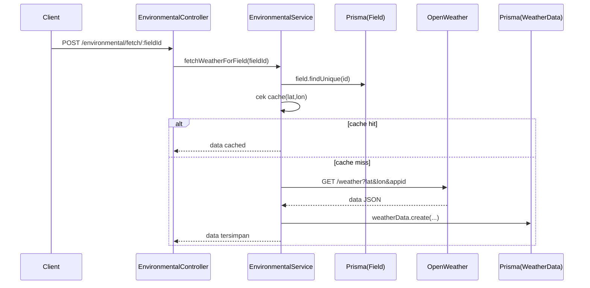

# Dokumentasi Modul Environmental (Weather)

## Deskripsi Umum

Modul Environmental mengintegrasikan OpenWeatherMap untuk:

- Mengambil cuaca terkini per field,
- Menyimpan history ke tabel `weather_data`,
- Menghitung statistik cuaca,
- Mengambil forecast 5 hari,
- Menjalankan cron untuk update berkala semua field.

## Struktur File

- Controller: [environmental.controller.ts](file:///d:/PROJECT/AWAL/Agricane/backend/src/environmental/environmental.controller.ts)
- Service: [environmental.service.ts](file:///d:/PROJECT/AWAL/Agricane/backend/src/environmental/environmental.service.ts)
- Cron: [environmental.cron.ts](file:///d:/PROJECT/AWAL/Agricane/backend/src/environmental/environmental.cron.ts)
- Module: [environmental.module.ts](file:///d:/PROJECT/AWAL/Agricane/backend/src/environmental/environmental.module.ts)

## Ringkasan Logika

- `EnvironmentalService`:
  - Mendapatkan `apiKey` & `baseUrl` dari `ConfigService` (`openWeather`).
  - In‑memory cache per koordinat `(lat, lon)` dengan TTL 10 menit.
  - `fetchWeatherForField(fieldId)`:
    - Ambil field (id, name, lat, lon).
    - Jika cache masih valid → kembalikan data cached.
    - Call `GET {baseUrl}/weather?lat=...&lon=...&appid={apiKey}&units=metric`.
    - Mapping ke `weatherData` (temperature, humidity, rainfall, windSpeed, pressure, weatherDesc).
    - Simpan ke tabel `weather_data` via Prisma.
  - `fetchWeatherForAllFields()`:
    - Loop semua field, panggil `fetchWeatherForField`, handle error per field, jeda 1 detik antar call.
  - `getWeatherHistory(fieldId, days)`: query data sejak `now - days`.
  - `getWeatherStats(fieldId, days)`:
    - Hitung rata‑rata temperature & humidity, total rainfall.
  - `getForecast(fieldId)`:
    - Call `GET {baseUrl}/forecast?lat=...` dan mapping list ke struktur forecast sederhana.
- `EnvironmentalCron.updateWeatherData()`:
  - Dijalankan setiap 6 jam (CronExpression.EVERY_6_HOURS).
  - Memanggil `fetchWeatherForAllFields` dan mencatat jumlah sukses/gagal di log.

## Fungsi Utama

- EnvironmentalService.fetchWeatherForField(fieldId: string)
- EnvironmentalService.fetchWeatherForAllFields()
- EnvironmentalService.getWeatherHistory(fieldId: string, days?: number)
- EnvironmentalService.getWeatherStats(fieldId: string, days?: number)
- EnvironmentalService.getForecast(fieldId: string)
- EnvironmentalCron.updateWeatherData()

## Alur Kerja

## Konfigurasi & Variabel Penting

- [configuration.ts](file:///d:/PROJECT/AWAL/Agricane/backend/src/config/configuration.ts#L17-L20)
  - `openWeather.apiKey` dari `OPENWEATHER_API_KEY`
  - `openWeather.baseUrl` (default `https://api.openweathermap.org/data/2.5`)
- Cron schedule:
  - `cron.weatherUpdate` di configuration (default `0 */6 * * *`), namun file cron saat ini menggunakan `CronExpression.EVERY_6_HOURS` langsung.

## Catatan Khusus

- Error API eksternal dibungkus `HttpException` dengan status `BAD_GATEWAY`.
- Cache menggunakan in‑memory `Map`; pada deployment multi‑instance, cache tidak ter‑share antar instance. Untuk skala besar bisa diganti Redis.  
