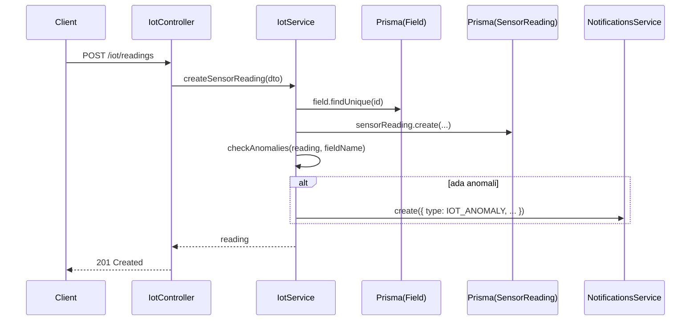

# Dokumentasi Modul IoT (Sensor & WebSocket)

## Deskripsi Umum

Modul IoT menangani:

- Penerimaan data sensor tanah (soil moisture, pH, temperature) via REST dan WebSocket.
- Penyimpanan data ke tabel `sensor_readings`.
- Analisis statistik dan deteksi anomali.
- Broadcast data real‑time dan event anomali ke frontend via Socket.IO.

## Struktur File

- Controller: [iot.controller.ts](file:///d:/PROJECT/AWAL/Agricane/backend/src/iot/iot.controller.ts)
- Service: [iot.service.ts](file:///d:/PROJECT/AWAL/Agricane/backend/src/iot/iot.service.ts)
- Gateway WebSocket: [iot.gateway.ts](file:///d:/PROJECT/AWAL/Agricane/backend/src/iot/iot.gateway.ts)
- Module: [iot.module.ts](file:///d:/PROJECT/AWAL/Agricane/backend/src/iot/iot.module.ts)
- DTO:
  - [create-sensor-reading.dto.ts](file:///d:/PROJECT/AWAL/Agricane/backend/src/iot/dto/create-sensor-reading.dto.ts)
  - [sensor-reading.dto.ts](file:///d:/PROJECT/AWAL/Agricane/backend/src/iot/dto/sensor-reading.dto.ts)

## Ringkasan Logika

- `IotController`:
  - `POST /iot/readings`: simpan reading baru (validasi DTO).
  - `GET /iot/readings/:fieldId/latest?limit`: ambil N terakhir.
  - `GET /iot/readings/:fieldId/history?hours`: history dalam X jam.
  - `GET /iot/readings/:fieldId/stats?hours`: statistik (average, min, max).
  - `GET /iot/readings/:fieldId/anomalies?hours`: reading yang melanggar batas threshold.
  - `POST /iot/simulate/:fieldId`: generate reading random untuk testing.
- `IotService`:
  - `createSensorReading`:
    - Validasi field ada.
    - Simpan ke `sensor_readings`.
    - Panggil `checkAnomalies` untuk membuat notifikasi bila perlu.
  - `getLatestReadings`, `getSensorHistory`, `getSensorStats`, `getAnomalousReadings`:
    - Query Prisma dengan filter waktu dan perhitungan agregat manual di memori.
  - `simulateSensorData`:
    - Membuat reading random dengan rentang wajar untuk demo (indikasi kuat kode ini hasil AI dan bisa diganti integrasi hardware nyata).
  - `checkAnomalies`:
    - Menghasilkan daftar pesan bila moisture, pH, atau temperature di luar rentang aman.
    - Jika ada anomali, membuat notifikasi via `NotificationsService.create`.
  - `identifyAnomalies`:
    - Mengembalikan list kode masalah (`low_moisture`, `acidic_soil`, dll.) untuk konsumsi frontend.
- `IotGateway`:
  - Namespace `/iot`, CORS `origin: '*'`.
  - Pelacakan client terhubung.
  - Event:
    - `subscribe_field` / `unsubscribe_field`: join/leave room `field:{id}`.
    - `sensor_data`: terima data sensor, simpan via `IotService.createSensorReading`, lalu emit `sensor_update` ke room.
    - `request_latest`: kirim latest reading ke client.
  - Helper:
    - `broadcastSensorUpdate`, `broadcastAnomaly` untuk broadcast dari service bila diperlukan.

## Fungsi Utama

- IotService.createSensorReading(data: { fieldId; soilMoisture; soilPH; soilTemperature })
- IotService.getLatestReadings(fieldId: string, limit?: number)
- IotService.getSensorHistory(fieldId: string, hours?: number)
- IotService.getSensorStats(fieldId: string, hours?: number)
- IotService.getAnomalousReadings(fieldId: string, hours?: number)
- IotService.simulateSensorData(fieldId: string)

## Alur Kerja REST

## Konfigurasi & Variabel Penting

- Tidak ada env khusus di modul ini.
- Threshold anomaly hard‑coded di `checkAnomalies` dan `identifyAnomalies`:
  - Moisture < 30 atau > 80,
  - pH < 5.5 atau > 8.0,
  - Temperature < 18°C atau > 35°C.

## Catatan Khusus

- Untuk produksi, threshold ini sebaiknya dikonfigurasi (misal via DB atau config) dan diselaraskan dengan rekomendasi agronomi.
- Simulasi data sangat berguna untuk integrasi dengan frontend saat perangkat IoT belum tersedia.  
