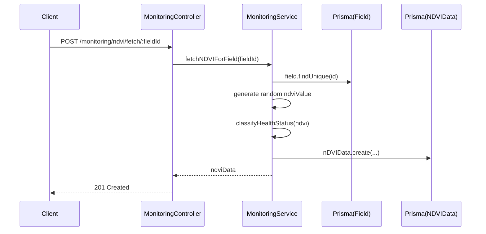

# Dokumentasi Modul Monitoring (NDVI & Drone)

## Deskripsi Umum

Modul Monitoring menyediakan:

- Pengambilan dan penyimpanan data NDVI (simulasi Copernicus Sentinel),
- Analisis tren kesehatan tanaman per field,
- Ringkasan kesehatan semua field,
- Pencatatan log penerbangan drone (flight log) terkait monitoring visual.

## Struktur File

- Controller: [monitoring.controller.ts](file:///d:/PROJECT/AWAL/Agricane/backend/src/monitoring/monitoring.controller.ts)
- Service: [monitoring.service.ts](file:///d:/PROJECT/AWAL/Agricane/backend/src/monitoring/monitoring.service.ts)
- Module: [monitoring.module.ts](file:///d:/PROJECT/AWAL/Agricane/backend/src/monitoring/monitoring.module.ts)

## Ringkasan Logika

- `MonitoringController`:
  - NDVI:
    - `POST /monitoring/ndvi/fetch/:fieldId`: fetch NDVI (simulasi).
    - `GET /monitoring/ndvi/history/:fieldId?days`: history NDVI.
  - Health:
    - `GET /monitoring/health/trend/:fieldId`: tren kesehatan berdasarkan NDVI 90 hari.
    - `GET /monitoring/health/summary`: ringkasan kesehatan semua field.
  - Drone:
    - `POST /monitoring/drone/flights`: buat flight log (operator default user saat ini jika tidak diisi).
    - `GET /monitoring/drone/flights/:fieldId`: list flight per field.
    - `GET /monitoring/drone/flight/:id`: detail satu flight.
    - `PATCH /monitoring/drone/flight/:id`: update flight.
    - `DELETE /monitoring/drone/flight/:id`: hapus flight.
- `MonitoringService`:
  - NDVI:
    - `fetchNDVIForField`:
      - Validasi field.
      - Menghasilkan nilai NDVI random 0.3–0.9, cloud cover random, dll.
      - Klasifikasikan ke enum `HealthStatus` (`HEALTHY`, `MODERATE_STRESS`, `SEVERE_STRESS`, `UNKNOWN`).
      - Simpan ke tabel `NDVIData`.
    - `getNDVIHistory(fieldId, days)`:
      - Ambil NDVI sejak `now - days`.
    - `getFieldHealthTrend`:
      - Hitung rata‑rata NDVI.
      - Bandingkan rata‑rata terbaru vs lama untuk menentukan `trend` (`improving`, `declining`, `stable`, `no_data`).
  - Drone:
    - `createDroneFlight`:
      - Validasi field dan operator.
      - Simpan log ke tabel `DroneFlight`.
    - `getDroneFlights(fieldId)`, `getDroneFlightById`, `updateDroneFlight`, `deleteDroneFlight`.
  - Summary:
    - `getFieldHealthSummary`:
      - Ambil semua field dengan NDVI terakhir (1 data per field),
      - Keluarkan ringkasan berisi `latestNDVI`, `healthStatus`, `lastUpdated`.

## Fungsi Utama

- MonitoringService.fetchNDVIForField(fieldId: string)
- MonitoringService.getNDVIHistory(fieldId: string, days?: number)
- MonitoringService.getFieldHealthTrend(fieldId: string)
- MonitoringService.getFieldHealthSummary()
- MonitoringService.createDroneFlight(data)
- MonitoringService.getDroneFlights(fieldId: string)
- MonitoringService.getDroneFlightById(id: string)
- MonitoringService.updateDroneFlight(id: string, data)
- MonitoringService.deleteDroneFlight(id: string)

## Alur Kerja NDVI

## Konfigurasi & Variabel Penting

- [configuration.ts](file:///d:/PROJECT/AWAL/Agricane/backend/src/config/configuration.ts#L27-L31)
  - `copernicus.clientId`, `clientSecret`, `baseUrl` disiapkan tetapi saat ini belum digunakan (NDVI masih simulasi).

## Catatan Khusus

- Karena NDVI masih random, modul ini cocok untuk prototipe UI dan arsitektur. Untuk produksi:
  - Integrasikan API Copernicus Sentinel (atau provider lain),
  - Ganti `fetchNDVIForField` agar memakai data satelit nyata,
  - Sesuaikan klasifikasi `HealthStatus` dengan standar agronomi yang valid.  
