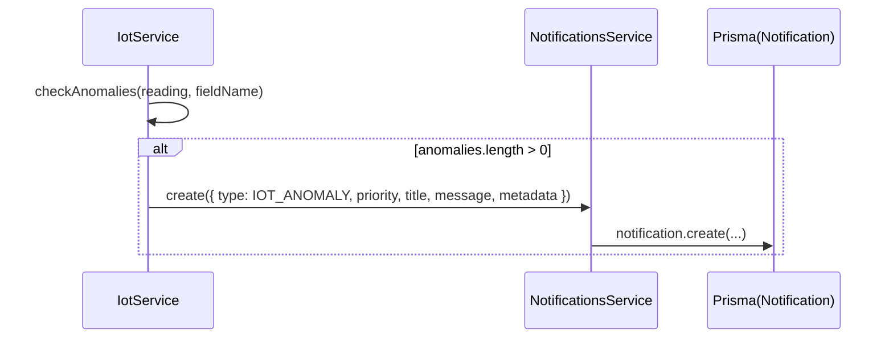

# Dokumentasi Modul Notifications

## Deskripsi Umum

Modul Notifications mengelola notifikasi sistem dan pengguna:

- Notifikasi generik: jenis (`type`), prioritas (`priority`), judul, pesan, metadata,
- Filter berdasarkan user, unread, type, priority,
- Helper khusus untuk weather alert dan harvest alert,
- Pembersihan notifikasi lama.

## Struktur File

- Controller: [notifications.controller.ts](file:///d:/PROJECT/AWAL/Agricane/backend/src/notifications/notifications.controller.ts)
- Service: [notifications.service.ts](file:///d:/PROJECT/AWAL/Agricane/backend/src/notifications/notifications.service.ts)
- Module: [notifications.module.ts](file:///d:/PROJECT/AWAL/Agricane/backend/src/notifications/notifications.module.ts)

## Ringkasan Logika

- `NotificationsController`:
  - `POST /notifications`: membuat notifikasi baru (umumnya dipakai oleh modul internal).
  - `GET /notifications?unreadOnly`: ambil notifikasi untuk user saat ini (via `CurrentUser`).
  - `GET /notifications/unread-count`: jumlah notifikasi belum dibaca.
  - `GET /notifications/by-type/:type`: filter berdasarkan `NotificationType`.
  - `GET /notifications/by-priority/:priority`: filter berdasarkan `NotificationPriority`.
  - `GET /notifications/:id`: detail notifikasi.
  - `PATCH /notifications/:id/read`: tandai satu notifikasi sebagai read.
  - `PATCH /notifications/mark-all-read`: tandai semua notifikasi milik user sebagai read.
  - `DELETE /notifications/:id`: hapus notifikasi.
- `NotificationsService`:
  - `create`:
    - Menyimpan notifikasi baru ke tabel `notifications`.
    - `userId` boleh null (notifikasi global).
  - `findAll(userId, unreadOnly)`:
    - Jika userId ada, filter `OR: [{ userId }, { userId: null }]`.
    - Jika `unreadOnly` true, tambahkan filter `isRead = false`.
  - `findOne`, `markAsRead`, `markAllAsRead`, `delete`.
  - `getUnreadCount(userId?)`: hitung unread, dengan logika OR yang sama.
  - `getNotificationsByType(type)`, `getNotificationsByPriority(priority)`.
  - Helper:
    - `createWeatherAlert(fieldId, fieldName, alertType, details)`.
    - `createHarvestAlert(fieldId, fieldName, cropAge)`.
    - `deleteOldNotifications(daysOld)`:
      - Hapus notifikasi read yang lebih tua dari `daysOld`.

## Fungsi Utama

- NotificationsService.create(dto: { userId?; type; priority; title; message; metadata? })
- NotificationsService.findAll(userId?: string, unreadOnly?: boolean)
- NotificationsService.findOne(id: string)
- NotificationsService.markAsRead(id: string)
- NotificationsService.markAllAsRead(userId: string)
- NotificationsService.delete(id: string)
- NotificationsService.getUnreadCount(userId?: string)
- NotificationsService.getNotificationsByType(type: string, limit?: number)
- NotificationsService.getNotificationsByPriority(priority: string, limit?: number)
- NotificationsService.createWeatherAlert(fieldId, fieldName, alertType, details)
- NotificationsService.createHarvestAlert(fieldId, fieldName, cropAge)
- NotificationsService.deleteOldNotifications(daysOld?: number)

## Alur Kerja Singkat

Contoh: Anomali sensor → notifikasi:

## Konfigurasi & Variabel Penting

- Enum `NotificationType` dan `NotificationPriority` didefinisikan dua kali:
  - Di Prisma schema,
  - Di [role.enum.ts](file:///d:/PROJECT/AWAL/Agricane/backend/src/common/enums/role.enum.ts#L23-L35) untuk konsumsi TypeScript.

## Catatan Khusus

- Banyak endpoint controller tidak membatasi role khusus; hanya membutuhkan user ter‑autentikasi.
- Metadata notifikasi bertipe `Json` di Prisma, sehingga bisa menampung struktur apapun (misalnya detail sensor, cuaca, dsb.).  
